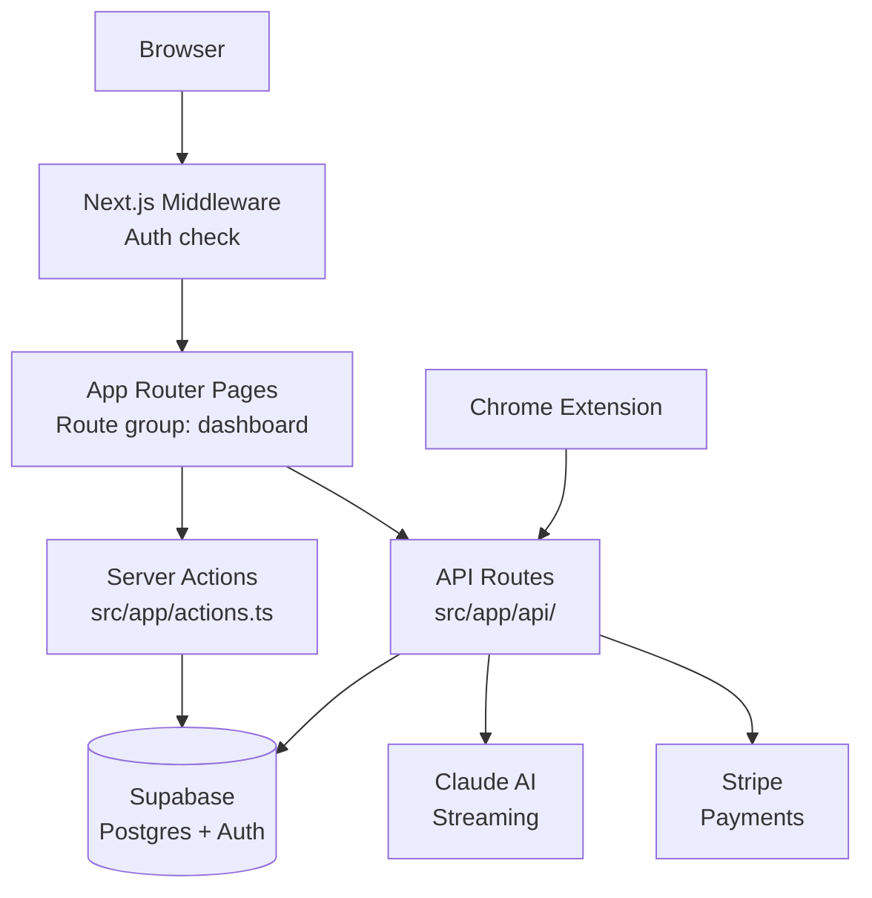

# Orianna

AI content coaching platform for TikTok/Instagram/YouTube Shorts creators.
Next.js 16.1.6 (App Router) + Supabase + Anthropic Claude SDK + Stripe + Tailwind v4 + shadcn/ui.

## Working Style
<!-- ultrathink -->
IMPORTANT: Think thoroughly before responding. Provide complete, detailed answers the first time — do not give partial lists or surface-level responses. Missing details costs more time than careful thinking upfront. When committing, always push to remote immediately (Vercel auto-deploys from main).

IMPORTANT: If you can do a task, DO IT — don't give the user manual steps for things you can execute. Only hand off when it truly requires their browser, credentials, or physical action. Recommend the simplest, most practical solution first — not the flashiest.

## Tech Stack
- **Runtime**: Next.js 16.1.6 App Router, TypeScript, React 19
- **Database & Auth**: Supabase (Postgres + RLS + Auth). Schema: `supabase/schema.sql`
- **AI**: Anthropic Claude SDK (`claude-sonnet-4-6`) — `src/lib/claude.ts`
- **Payments**: Stripe — `src/lib/stripe.ts`, `src/lib/tiers.ts`, `src/lib/usage.ts`
- **Styling**: Tailwind CSS v4 + shadcn/ui. Design system: see `DESIGN.md`
- **Monitoring**: Sentry (client + server + edge configs at project root)
- **Testing**: Playwright e2e — 5 spec files in `e2e/`, 36 tests passing
- **Deployment**: Vercel (push to main = auto-deploy). Crons in `vercel.json`

## Architecture



### Route structure
- `(auth)/` — login, signup
- `(dashboard)/dashboard/*` — main app (coach, scripts, ideas, inspo, competitors, my-videos, schedule, settings, cleanup)
- `onboarding/` — 4-step wizard
- `api/` — 14 route groups (auth, coach, competitors, cron, download, extension, ideas, insights, posts, scripts, social, stripe, thumbnail, usage)

### DB schema

```mermaid
erDiagram
  profiles ||--o{ posts : "user_id"
  profiles ||--o{ scripts : "user_id"
  profiles ||--o{ content_ideas : "user_id"
  profiles ||--o{ competitors : "user_id"
  profiles ||--o{ coach_messages : "user_id"
  profiles ||--o{ usage : "user_id"
  posts { uuid user_id; bool is_competitor; bool is_trending; int views; float engagement }
  scripts { text hook; text body; text cta; text[] hashtags; jsonb variants }
  content_ideas { text idea; text status; text production_status; text hook_idea }
  competitors { text handle; text platform; int follower_count }
```

`posts` table serves triple duty: user posts (`is_competitor=false, is_trending=false`), competitor posts (`is_competitor=true`), swipe file (`is_trending=true`).

## Critical Patterns

**All mutations go through server actions** (`src/app/actions.ts`, ~800 lines).
Browser client direct Supabase writes silently fail (0 rows, no error). Only use browser client for reads.

**Profile UPSERT, not UPDATE.** The Supabase `handle_new_user` trigger may not fire, leaving no profile row. Always:
```ts
supabase.from('profiles').upsert(
  { user_id: user.id, email: user.email ?? '', ...fields },
  { onConflict: 'user_id' }
)
```

**Supabase clients:**
- Server (cookies): `src/lib/supabase/server.ts`
- Browser (anon key): `src/lib/supabase/client.ts`
- Service role: `src/lib/supabase/service.ts`
- Middleware: `src/lib/supabase/middleware.ts`

**AI system prompt** uses `knowledge/` directory (5 coaching guides) loaded via `src/lib/knowledge.ts`. Coach context includes user's scripts, ideas, and post analytics.

## Development

- `npm run dev` — local server
- `npx playwright test` — e2e tests (5 specs, 36 tests)
- Push to main = auto-deploy via Vercel
- Vercel crons: `/api/cron/publish` (daily 9am), `/api/cron/cleanup` (daily 3am)

## Gotchas
- Route group `(dashboard)` is NOT in the URL — pages are at `/dashboard/*`
- Some DB columns only exist via migrations, not in original `schema.sql` (e.g. `content_ideas.hook_idea`, `competitors.profile_url`)
- `.env.local` for all secrets (Supabase, Anthropic, Stripe, Sentry, Resend)

## Reference
- See `README.md` for full project structure and local setup
- See `DESIGN.md` for colors, typography, component styles
- See `supabase/schema.sql` + `supabase/migrations/` for authoritative DB schema
- See `knowledge/` for AI coaching knowledge base (5 files)
